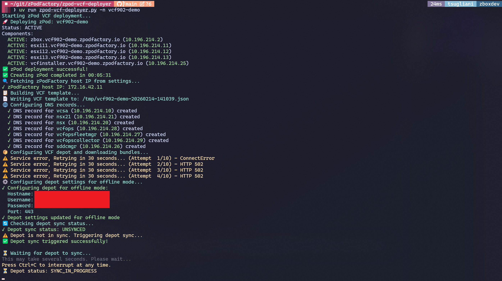
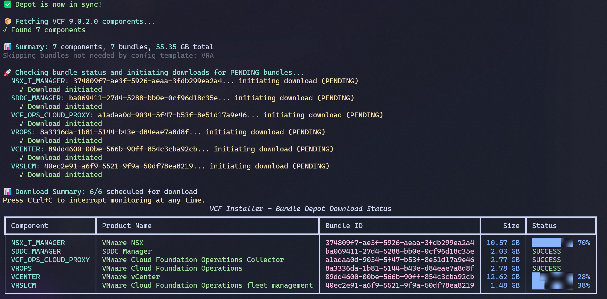
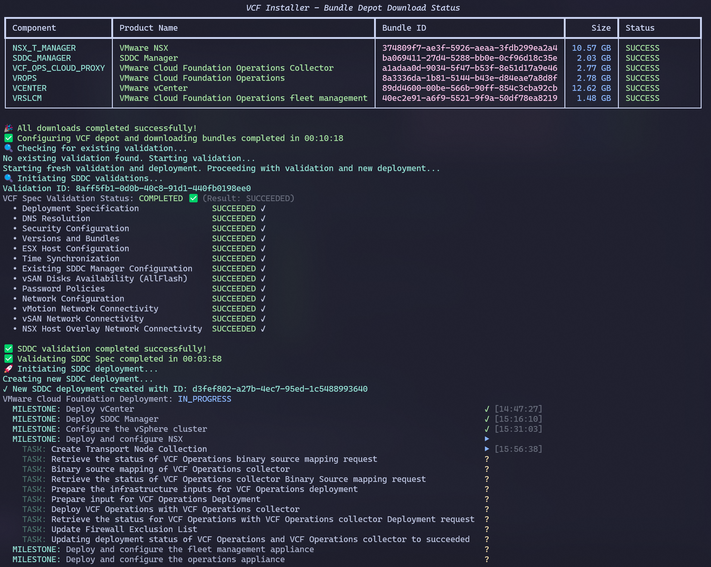
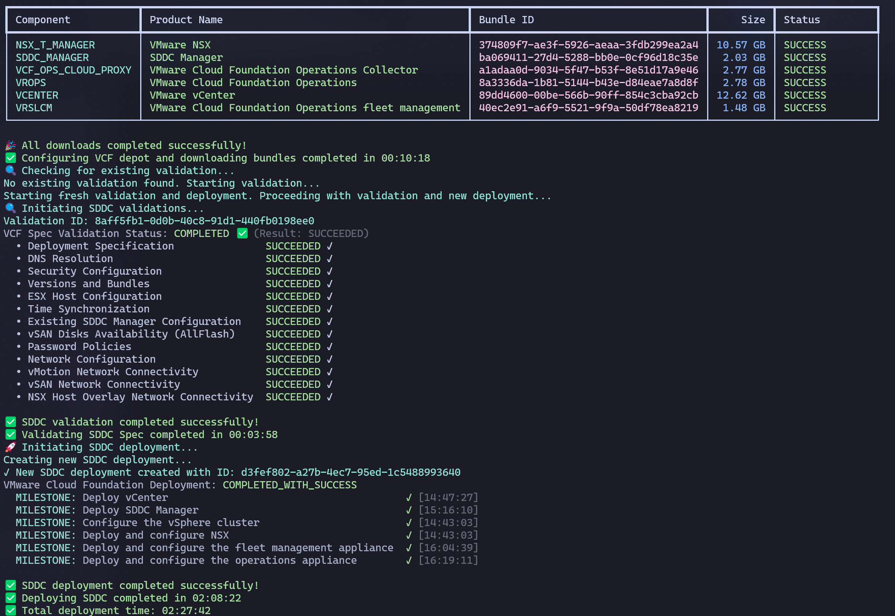

# zPod VCF Deployer

Automated end-to-end deployment of VMware Cloud Foundation (VCF) on [zPodFactory](https://zpodfactory.github.io)-provisioned infrastructure.

The deployer handles the full pipeline: 
- zPod provisioning
- DNS configuration 
- VCF depot setup for vcf installer (online or offline depot)
- Automate bundle downloads
- SDDC validation
- SDDC deployment

All with live terminal progress tracking.

This script has been vibe code with Cursor & Claude Code for fun.

That said, 100+ VCF instances for trainings, labs, architecture & design testing have been deployed with this script over the last 2 years, so quite useful to get a VCF instance for many use cases (~2h30 deployment time per instance)

## Prerequisites

- [uv](https://docs.astral.sh/uv/) (Python package runner)
- A running [zPodFactory](https://zpodfactory.github.io) instance with a valid access token
- A VCF depot — either:
  - **Online**: A Broadcom download token that will allow to pull all components from the Broadcom website directly
  - **Offline**: A VCF depot server (see [doc-vcf-offlinedepot](https://github.com/tsugliani/doc-vcf-offlinedepot) for setup instructions)

No manual Python environment setup is needed. The script uses [PEP 723](https://peps.python.org/pep-0723/) inline metadata, so `uv run` automatically installs all dependencies (httpx, rich, typer, jinja2, python-dotenv).

## Quick Start

1. Clone the repository:

   ```bash
   git clone https://github.com/zPodFactory/zpod-vcf-deployer.git
   cd zpod-vcf-deployer
   ```

2. Create your `.env` file from the example:

   ```bash
   cp env_example.txt .env
   ```

3. Edit `.env` with your settings (see [Environment Variables](#environment-variables) below).

4. Run the deployer:

   ```bash
   uv run zpod-vcf-deployer.py -n demo
   ```

   That's it. With all settings configured in `.env`, the only required argument is the zPod name (`-n`).

## Environment Variables

All settings can be configured in a `.env` file (loaded automatically) or passed as CLI flags. The `.env` approach is recommended since most values stay constant across deployments.

### zPodFactory Settings (required)

| Variable | Description |
|----------|-------------|
| `ZPODFACTORY_BASE_URL` | zPodFactory API URL (e.g. `http://zpodfactory.example.com:8000`) |
| `ZPODFACTORY_ACCESS_TOKEN` | Your zPodFactory API access token |
| `ZPODFACTORY_DEFAULT_ENDPOINT` | zPodFactory endpoint name to deploy on |
| `ZPODFACTORY_DEFAULT_PROFILE` | zPod profile to use (e.g. `vcf9-mgmt-3nodes`) |

### VCF Template (required)

| Variable | Description |
|----------|-------------|
| `VCF_JSON_TEMPLATE` | Path to the VCF JSON template (e.g. `config/v902_std_3hosts.json`) |

### VCF Depot Mode (required)

| Variable | Description |
|----------|-------------|
| `VCF_DEPOT_MODE` | `online` or `offline` |

**If using online mode:**

| Variable | Description |
|----------|-------------|
| `VCF_ONLINE_DEPOT_DOWNLOAD_TOKEN` | VMware/Broadcom download token |

**If using offline mode:**

| Variable | Description |
|----------|-------------|
| `VCF_OFFLINE_DEPOT_HOSTNAME` | Offline depot server hostname |
| `VCF_OFFLINE_DEPOT_USERNAME` | Offline depot username |
| `VCF_OFFLINE_DEPOT_PASSWORD` | Offline depot password |
| `VCF_OFFLINE_DEPOT_PORT` | Offline depot port (default: `443`) |

### Optional Settings

| Variable | Default | Description |
|----------|---------|-------------|
| `VCF_SKU` | `VCF` | VCF SKU — `VCF` (standard) or `VVF` (VMware validated) |
| `VCF_VERSION` | `9.0.2.0` | VCF version to deploy |

### Example `.env` (offline depot)

```env
# zPodFactory
ZPODFACTORY_DEFAULT_ENDPOINT=my-endpoint
ZPODFACTORY_ACCESS_TOKEN=my-access-token
ZPODFACTORY_BASE_URL=http://zpodfactory.example.com:8000
ZPODFACTORY_DEFAULT_PROFILE=vcf9-mgmt-3nodes

# VCF Template
VCF_JSON_TEMPLATE=config/v902_std_3hosts.json

# Depot
VCF_DEPOT_MODE=offline
VCF_OFFLINE_DEPOT_HOSTNAME=offlinedepot.corp.com
VCF_OFFLINE_DEPOT_USERNAME=username
VCF_OFFLINE_DEPOT_PASSWORD=password
VCF_OFFLINE_DEPOT_PORT=443

# VCF
VCF_SKU=VCF
VCF_VERSION=9.0.2.0
```

> [!TIP]
> Highly recommended to set the `.env` file to your liking, it will allow to run the CLI with minimal arguments going forward, much simpler and neat.

## Usage

### Typical usage (settings from `.env`)

```bash
uv run zpod-vcf-deployer.py -n demo
```

### With debug output

```bash
uv run zpod-vcf-deployer.py -n demo --debug
```

Debug mode logs full API request/response details for troubleshooting.

### Override `.env` values via CLI

Any `.env` setting can be overridden on the command line:

```bash
uv run zpod-vcf-deployer.py -n demo \
  --vcf-json-template config/v902_std_3hosts.json \
  --zpodfactory-profile vcf9-mgmt-3nodes \
  --vcf-version 9.0.2.0
```

### Help

```bash
uv run zpod-vcf-deployer.py --help

 Usage: zpod-vcf-deployer.py [OPTIONS]

 zPod VCF Deployer - Unified deployment and VCF depot management tool

 Examples:

 Online Mode:
 uv run zpod-vcf-deployer.py \
   --vcf-json-template config/v902_std_3hosts.json \
   --zpod-name my-zpod \
   --zpodfactory-profile vcf \
   --zpodfactory-endpoint my-endpoint \
   --zpodfactory-access-token your-token \
   --zpodfactory-base-url http://zpodfactory.example.com:8000 \
   --depot-mode online \
   --online-depot-download-token your-download-token

 Offline Mode:
 uv run zpod-vcf-deployer.py \
   --vcf-json-template config/v902_std_3hosts.json \
   --zpod-name my-zpod \
   --zpodfactory-profile vcf \
   --zpodfactory-endpoint my-endpoint \
   --zpodfactory-access-token your-token \
   --zpodfactory-base-url http://zpodfactory.example.com:8000 \
   --depot-mode offline \
   --offline-depot-hostname depot.example.com \
   --offline-depot-username depot-user \
   --offline-depot-password depot-password

╭─ Options ─────────────────────────────────────────────────────────────────────────────────────────────────────────────────────────────────╮
│ *  --vcf-json-template            -j      FILENAME  VCF JSON template file [env var: VCF_JSON_TEMPLATE] [required]                        │
│ *  --zpod-name                    -n      TEXT      zPod name [required]                                                                  │
│ *  --zpodfactory-profile          -p      TEXT      zPodFactory profile name [env var: ZPODFACTORY_DEFAULT_PROFILE] [required]            │
│ *  --zpodfactory-endpoint         -e      TEXT      zPodFactory endpoint name [env var: ZPODFACTORY_DEFAULT_ENDPOINT] [required]          │
│ *  --zpodfactory-access-token     -a      TEXT      zPodFactory access token [env var: ZPODFACTORY_ACCESS_TOKEN] [required]               │
│ *  --zpodfactory-base-url         -u      TEXT      zPodFactory base URL [env var: ZPODFACTORY_BASE_URL] [required]                       │
│    --depot-mode                           TEXT      Depot mode (online or offline) [env var: VCF_DEPOT_MODE] [default: offline]           │
│    --online-depot-download-token          TEXT      Online depot download token [env var: VCF_ONLINE_DEPOT_DOWNLOAD_TOKEN]                │
│    --offline-depot-hostname               TEXT      Offline depot hostname [env var: VCF_OFFLINE_DEPOT_HOSTNAME]                          │
│    --offline-depot-username               TEXT      Offline depot username [env var: VCF_OFFLINE_DEPOT_USERNAME]                          │
│    --offline-depot-password               TEXT      Offline depot password [env var: VCF_OFFLINE_DEPOT_PASSWORD]                          │
│    --vcf-sku                              TEXT      VCF SKU (VCF or VVF) [env var: VCF_SKU] [default: VCF]                                │
│    --vcf-version                          TEXT      VCF version [env var: VCF_VERSION] [default: 9.0.0.0]                                 │
│    --offline-depot-port                   INTEGER   Offline depot port [env var: VCF_OFFLINE_DEPOT_PORT] [default: 443]                   │
│    --debug                        -d                Enable debug output (API headers, payloads, responses)                                │
│    --version                                        Show the version and exit.                                                            │
│    --install-completion                             Install completion for the current shell.                                             │
│    --show-completion                                Show completion for the current shell, to copy it or customize the installation.      │
│    --help                                           Show this message and exit.                                                           │
╰───────────────────────────────────────────────────────────────────────────────────────────────────────────────────────────────────────────╯
```


### All CLI Options

| Flag | Short | Env Variable | Description |
|------|-------|-------------|-------------|
| `--zpod-name` | `-n` | — | zPod name (**required**, no env default) |
| `--vcf-json-template` | `-j` | `VCF_JSON_TEMPLATE` | VCF JSON template file |
| `--zpodfactory-profile` | `-p` | `ZPODFACTORY_DEFAULT_PROFILE` | zPodFactory profile |
| `--zpodfactory-endpoint` | `-e` | `ZPODFACTORY_DEFAULT_ENDPOINT` | zPodFactory endpoint |
| `--zpodfactory-access-token` | `-a` | `ZPODFACTORY_ACCESS_TOKEN` | zPodFactory access token |
| `--zpodfactory-base-url` | `-u` | `ZPODFACTORY_BASE_URL` | zPodFactory base URL |
| `--depot-mode` | | `VCF_DEPOT_MODE` | `online` or `offline` |
| `--online-depot-download-token` | | `VCF_ONLINE_DEPOT_DOWNLOAD_TOKEN` | Online depot token |
| `--offline-depot-hostname` | | `VCF_OFFLINE_DEPOT_HOSTNAME` | Offline depot hostname |
| `--offline-depot-username` | | `VCF_OFFLINE_DEPOT_USERNAME` | Offline depot username |
| `--offline-depot-password` | | `VCF_OFFLINE_DEPOT_PASSWORD` | Offline depot password |
| `--offline-depot-port` | | `VCF_OFFLINE_DEPOT_PORT` | Offline depot port |
| `--vcf-sku` | | `VCF_SKU` | `VCF` or `VVF` |
| `--vcf-version` | | `VCF_VERSION` | VCF version |
| `--debug` | `-d` | — | Enable debug output |
| `--version` | | — | Show version and exit |

## Available Templates

| Template | VCF Version | Hosts | Description |
|----------|-------------|-------|-------------|
| `config/v900_std_3hosts.json` | 9.0.0 | 3 | Standard 3-host deployment |
| `config/v901_std_3hosts.json` | 9.0.1 | 3 | Standard 3-host deployment |
| `config/v901_std_4hosts.json` | 9.0.1 | 4 | Standard 4-host deployment |
| `config/v902_std_3hosts.json` | 9.0.2 | 3 | Standard 3-host deployment |

Templates are Jinja2-enabled JSON files. Variables like `{{zpod_name}}`, `{{zpod_domain}}`, and `{{zpod_password}}` are automatically populated from the zPod configuration at deploy time.

Those VCF templates match zPodFactory profiles, here is a sample one used for small deployments

```
$ just zcli profile info vcf9-mgmt-3nodes
                                           Profile Info
┏━━━━━━━━━━━━━━━━━━┳━━━━━━━━━━━━━━━━━━━━━━━━━━━━━━━━━━━━━━━━━━━━━━━━━━━━━━━━━━━━━━━━━━━━━━━━━━━━━━┓
┃ Name             ┃ Components                                                                   ┃
┡━━━━━━━━━━━━━━━━━━╇━━━━━━━━━━━━━━━━━━━━━━━━━━━━━━━━━━━━━━━━━━━━━━━━━━━━━━━━━━━━━━━━━━━━━━━━━━━━━━┩
│ vcf9-mgmt-3nodes │ zbox-12.11                                                                   │
│                  │ esxi-9.0.2.0 (Host Id: 11, CPU: 16, Mem: 128GB, NICs: 4, Disks: 40GB, 800GB) │
│                  │ esxi-9.0.2.0 (Host Id: 12, CPU: 16, Mem: 128GB, NICs: 4, Disks: 40GB, 800GB) │
│                  │ esxi-9.0.2.0 (Host Id: 13, CPU: 16, Mem: 128GB, NICs: 4, Disks: 40GB, 800GB) │
│                  │ vcfinstaller-9.0.2.0                                                         │
└──────────────────┴──────────────────────────────────────────────────────────────────────────────┘
```

Sample zPodFactory profile json template specification used:

```
$ just zcli profile info vcf9-mgmt-3nodes -j 
[
  {
    "component_uid": "zbox-12.11"
  },
  [
    {
      "component_uid": "esxi-9.0.2.0",
      "host_id": 11,
      "hostname": "esxi11",
      "vcpu": 16,
      "vdisks": [
        40,
        800
      ],
      "vmem": 128,
      "vnics": 4
    },
    {
      "component_uid": "esxi-9.0.2.0",
      "host_id": 12,
      "hostname": "esxi12",
      "vcpu": 16,
      "vdisks": [
        40,
        800
      ],
      "vmem": 128,
      "vnics": 4
    },
    {
      "component_uid": "esxi-9.0.2.0",
      "host_id": 13,
      "hostname": "esxi13",
      "vcpu": 16,
      "vdisks": [
        40,
        800
      ],
      "vmem": 128,
      "vnics": 4
    }
  ],
  {
    "component_uid": "vcfinstaller-9.0.2.0"
  }
]
```


## Deployment Pipeline

When you run the deployer, it executes these steps in order:

1. **Provision zPod** — Creates a new zPod via the zPodFactory API and waits for it to become active
2. **Render VCF config** — Processes the Jinja2 template with zPod-specific variables (network, domain, passwords)
3. **Configure DNS** — Creates DNS records for all VCF components (vCenter, NSX, ESXi hosts, SDDC Manager)
4. **Set up VCF depot** — Configures the online or offline depot on the VCF installer
5. **Download bundles** — Downloads required VCF bundles (ESXi, vCenter, NSX-T, etc.)
6. **Validate SDDC** — Runs VCF validation checks on the SDDC spec with live status tracking
7. **Deploy SDDC** — Deploys the SDDC with real-time milestone progress display

Each step is timed and reported. The full deployment typically takes a few hours depending on bundle download speeds and environment performance. You can safely interrupt with `Ctrl+C` — the deployer handles graceful shutdown.

Most of my deployments take around 2 hours and 30 minutes. (Tested on physical SDDC vSphere 8u3+ VSAN OSA Cluster with 4 hosts & NVMe Storage + NSX 4.2)

## Screenshots

Deployment initialization



Offline Depot configuration & bundles download status



Deployment progress live global milestones/tasks status



Deployment completion



## Screencast

Because screencasts are beautiful !

<a href="https://asciinema.org/a/xRhaXddDXgdSCkt3" target="_blank"></a>
