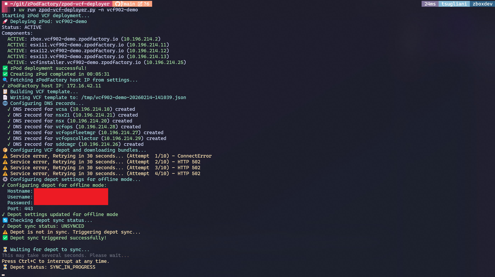
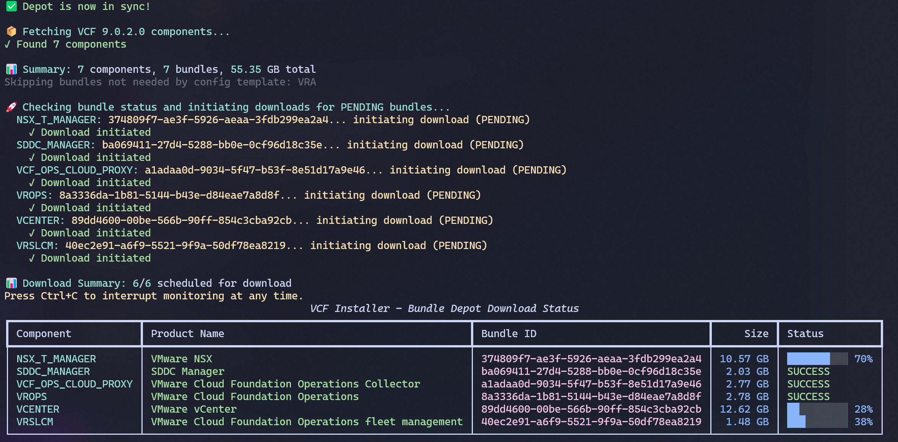
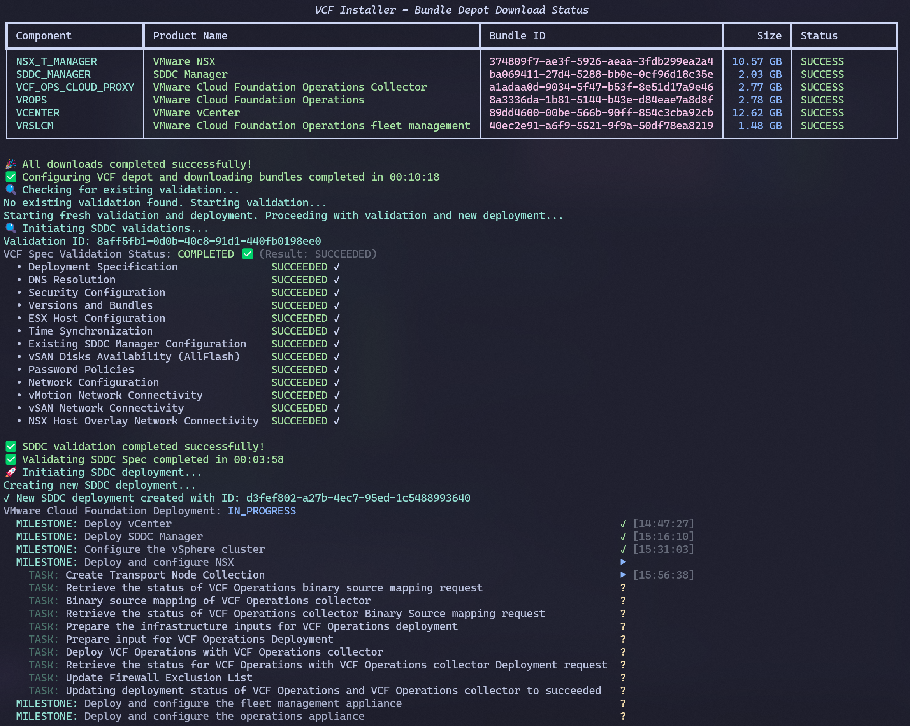
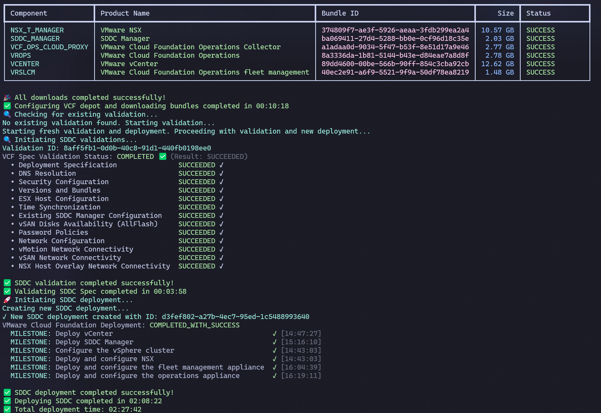

# zPod VCF Deployer

Automated end-to-end deployment of VMware Cloud Foundation (VCF) on [zPodFactory](https://zpodfactory.github.io)-provisioned infrastructure.

The deployer handles the full pipeline: 
- zPod provisioning
- DNS configuration 
- VCF depot setup for vcf installer (online or offline depot)
- Automate bundle downloads
- SDDC validation
- SDDC deployment

All with live terminal progress tracking.

This script has been vibe code with Cursor & Claude Code for fun.

That said, 100+ VCF instances for trainings, labs, architecture & design testing have been deployed with this script over the last 2 years, so quite useful to get a VCF instance for many use cases (~2h30 deployment time per instance)

## Prerequisites

- [uv](https://docs.astral.sh/uv/) (Python package runner)
- A running [zPodFactory](https://zpodfactory.github.io) instance with a valid access token
- A VCF depot — either:
  - **Online**: A Broadcom download token that will allow to pull all components from the Broadcom website directly
  - **Offline**: A VCF depot server (see [doc-vcf-offlinedepot](https://github.com/tsugliani/doc-vcf-offlinedepot) for setup instructions)

No manual Python environment setup is needed. The script uses [PEP 723](https://peps.python.org/pep-0723/) inline metadata, so `uv run` automatically installs all dependencies (httpx, rich, typer, jinja2, python-dotenv, asyncssh).

Both **VCF 9.0.x** and **VCF 9.1.x** are supported. The deployer auto-detects the version family from the `version` field of the selected template and adapts its behavior (DNS records, depot components, ESXi preparation, progress display) accordingly.

## Quick Start

1. Clone the repository:

   ```bash
   git clone https://github.com/zPodFactory/zpod-vcf-deployer.git
   cd zpod-vcf-deployer
   ```

2. Create your `.env` file from the example:

   ```bash
   cp env_example.txt .env
   ```

3. Edit `.env` with your settings (see [Environment Variables](#environment-variables) below).

4. Run the deployer:

   ```bash
   uv run zpod-vcf-deployer.py -n demo
   ```

   That's it. With all settings configured in `.env`, the only required argument is the zPod name (`-n`).

## Environment Variables

All settings can be configured in a `.env` file (loaded automatically) or passed as CLI flags. The `.env` approach is recommended since most values stay constant across deployments.

### zPodFactory Settings (required)

| Variable | Description |
|----------|-------------|
| `ZPODFACTORY_BASE_URL` | zPodFactory API URL (e.g. `http://zpodfactory.example.com:8000`) |
| `ZPODFACTORY_ACCESS_TOKEN` | Your zPodFactory API access token |
| `ZPODFACTORY_DEFAULT_ENDPOINT` | zPodFactory endpoint name to deploy on |
| `ZPODFACTORY_DEFAULT_PROFILE` | zPod profile to use (e.g. `vcf-902-3hosts`) |

### VCF Template (required)

| Variable | Description |
|----------|-------------|
| `VCF_JSON_TEMPLATE` | Path to the VCF JSON template (e.g. `config/v902_std_3hosts.json`) |

### VCF Depot Mode (required)

| Variable | Description |
|----------|-------------|
| `VCF_DEPOT_MODE` | `online` or `offline` |

> ⚠️ **VCF 9.1+ requires offline depot.** Starting with 9.1, VMware replaced the
> online depot with a new activation system, so online mode no longer works. The
> deployer detects a 9.1+ template and exits early if `--depot-mode online` is
> set — use the offline depot for 9.1 and later. Online mode remains valid for
> 9.0.x.

**If using online mode (9.0.x only):**

| Variable | Description |
|----------|-------------|
| `VCF_ONLINE_DEPOT_DOWNLOAD_TOKEN` | VMware/Broadcom download token |

**If using offline mode:**

| Variable | Description |
|----------|-------------|
| `VCF_OFFLINE_DEPOT_HOSTNAME` | Offline depot server hostname |
| `VCF_OFFLINE_DEPOT_USERNAME` | Offline depot username |
| `VCF_OFFLINE_DEPOT_PASSWORD` | Offline depot password |
| `VCF_OFFLINE_DEPOT_PORT` | Offline depot port (default: `443`) |

> The VCF release version and SKU are **not** environment/CLI settings — they
> are read from the template's mandatory top-level `version` and `workflowType`
> keys (`workflowType` is `VCF` or `VVF`).

### Example `.env` (offline depot)

```env
# zPodFactory
ZPODFACTORY_DEFAULT_ENDPOINT=my-endpoint
ZPODFACTORY_ACCESS_TOKEN=my-access-token
ZPODFACTORY_BASE_URL=http://zpodfactory.example.com:8000
ZPODFACTORY_DEFAULT_PROFILE=vcf-902-3hosts

# VCF Template
VCF_JSON_TEMPLATE=config/v902_std_3hosts.json

# Depot
VCF_DEPOT_MODE=offline
VCF_OFFLINE_DEPOT_HOSTNAME=offlinedepot.corp.com
VCF_OFFLINE_DEPOT_USERNAME=username
VCF_OFFLINE_DEPOT_PASSWORD=password
VCF_OFFLINE_DEPOT_PORT=443
```

> [!TIP]
> Highly recommended to set the `.env` file to your liking, it will allow to run the CLI with minimal arguments going forward, much simpler and neat.

## Usage

### Typical usage (settings from `.env`)

```bash
uv run zpod-vcf-deployer.py -n demo
```

### With debug output

```bash
uv run zpod-vcf-deployer.py -n demo --debug
```

`--debug` prints full API request/response details (headers, payloads, responses) to the screen for troubleshooting.

### With debug logging to a file

```bash
uv run zpod-vcf-deployer.py -n demo --debug-log
```

`--debug-log` writes the same verbose debug detail to a timestamped log file in the current directory (e.g. `zpod-vcf-deployer-demo-20260515-143022.log`) while keeping the on-screen output clean. `--debug` and `--debug-log` can be combined to get both.

### Validate only, deploy later

```bash
# 1) Provision + validate the SDDC spec, then stop before deployment
uv run zpod-vcf-deployer.py -n demo -j config/v9.1.0.0_std_3hosts.json -p vcf-910-3hosts --verify-only

# 2) When ready, re-run WITHOUT --verify-only to deploy the validated spec
uv run zpod-vcf-deployer.py -n demo -j config/v9.1.0.0_std_3hosts.json -p vcf-910-3hosts
```

`--verify-only` stops right after `✅ SDDC validation completed successfully`, before any SDDC deployment is created. Re-running without the flag picks up the existing validation and proceeds straight to deployment — it does not re-validate from scratch. If a deployment already exists, `--verify-only` is a no-op and reports so.

### Override `.env` values via CLI

Any `.env` setting can be overridden on the command line:

```bash
uv run zpod-vcf-deployer.py -n demo \
  --vcf-json-template config/v9.0.1.0_std_3hosts.json \
  --zpodfactory-profile vcf-901-3hosts
```

> The VCF release version and SKU are taken from the template's mandatory
> top-level `version` and `workflowType` keys — there are no `--vcf-version`
> or `--vcf-sku` flags.

### Help

```bash
uv run zpod-vcf-deployer.py --help

 Usage: zpod-vcf-deployer.py [OPTIONS]

 zPod VCF Deployer - Unified deployment and VCF depot management tool

 Examples:

 Online Mode:
 uv run zpod-vcf-deployer.py \
   --vcf-json-template config/v902_std_3hosts.json \
   --zpod-name my-zpod \
   --zpodfactory-profile vcf-902-3hosts \
   --zpodfactory-endpoint my-endpoint \
   --zpodfactory-access-token your-token \
   --zpodfactory-base-url http://zpodfactory.example.com:8000 \
   --depot-mode online \
   --online-depot-download-token your-download-token

 Offline Mode:
 uv run zpod-vcf-deployer.py \
   --vcf-json-template config/v902_std_3hosts.json \
   --zpod-name my-zpod \
   --zpodfactory-profile vcf-902-3hosts \
   --zpodfactory-endpoint my-endpoint \
   --zpodfactory-access-token your-token \
   --zpodfactory-base-url http://zpodfactory.example.com:8000 \
   --depot-mode offline \
   --offline-depot-hostname depot.example.com \
   --offline-depot-username depot-user \
   --offline-depot-password depot-password

╭─ Options ─────────────────────────────────────────────────────────────────────────────────────────────────────────────────────────────────╮
│ *  --vcf-json-template            -j      FILENAME  VCF JSON template file [env var: VCF_JSON_TEMPLATE] [required]                        │
│ *  --zpod-name                    -n      TEXT      zPod name [required]                                                                  │
│ *  --zpodfactory-profile          -p      TEXT      zPodFactory profile name [env var: ZPODFACTORY_DEFAULT_PROFILE] [required]            │
│ *  --zpodfactory-endpoint         -e      TEXT      zPodFactory endpoint name [env var: ZPODFACTORY_DEFAULT_ENDPOINT] [required]          │
│ *  --zpodfactory-access-token     -a      TEXT      zPodFactory access token [env var: ZPODFACTORY_ACCESS_TOKEN] [required]               │
│ *  --zpodfactory-base-url         -u      TEXT      zPodFactory base URL [env var: ZPODFACTORY_BASE_URL] [required]                       │
│    --depot-mode                           TEXT      Depot mode (online or offline) [env var: VCF_DEPOT_MODE] [default: offline]           │
│    --online-depot-download-token          TEXT      Online depot download token [env var: VCF_ONLINE_DEPOT_DOWNLOAD_TOKEN]                │
│    --offline-depot-hostname               TEXT      Offline depot hostname [env var: VCF_OFFLINE_DEPOT_HOSTNAME]                          │
│    --offline-depot-username               TEXT      Offline depot username [env var: VCF_OFFLINE_DEPOT_USERNAME]                          │
│    --offline-depot-password               TEXT      Offline depot password [env var: VCF_OFFLINE_DEPOT_PASSWORD]                          │
│    --offline-depot-port                   INTEGER   Offline depot port [env var: VCF_OFFLINE_DEPOT_PORT] [default: 443]                   │
│    --verify-only                                    Run the SDDC validation and stop before deployment                                     │
│    --debug                        -d                Enable debug output on screen (API headers, payloads, responses)                       │
│    --debug-log                                      Write debug output to a timestamped log file in the current directory                  │
│    --version                                        Show the version and exit.                                                            │
│    --install-completion                             Install completion for the current shell.                                             │
│    --show-completion                                Show completion for the current shell, to copy it or customize the installation.      │
│    --help                                           Show this message and exit.                                                           │
╰───────────────────────────────────────────────────────────────────────────────────────────────────────────────────────────────────────────╯
```


### All CLI Options

| Flag | Short | Env Variable | Description |
|------|-------|-------------|-------------|
| `--zpod-name` | `-n` | — | zPod name (**required**, no env default) |
| `--vcf-json-template` | `-j` | `VCF_JSON_TEMPLATE` | VCF JSON template file |
| `--zpodfactory-profile` | `-p` | `ZPODFACTORY_DEFAULT_PROFILE` | zPodFactory profile |
| `--zpodfactory-endpoint` | `-e` | `ZPODFACTORY_DEFAULT_ENDPOINT` | zPodFactory endpoint |
| `--zpodfactory-access-token` | `-a` | `ZPODFACTORY_ACCESS_TOKEN` | zPodFactory access token |
| `--zpodfactory-base-url` | `-u` | `ZPODFACTORY_BASE_URL` | zPodFactory base URL |
| `--depot-mode` | | `VCF_DEPOT_MODE` | `online` or `offline` |
| `--online-depot-download-token` | | `VCF_ONLINE_DEPOT_DOWNLOAD_TOKEN` | Online depot token |
| `--offline-depot-hostname` | | `VCF_OFFLINE_DEPOT_HOSTNAME` | Offline depot hostname |
| `--offline-depot-username` | | `VCF_OFFLINE_DEPOT_USERNAME` | Offline depot username |
| `--offline-depot-password` | | `VCF_OFFLINE_DEPOT_PASSWORD` | Offline depot password |
| `--offline-depot-port` | | `VCF_OFFLINE_DEPOT_PORT` | Offline depot port |
| `--verify-only` | | — | Run the SDDC validation and stop before deployment (re-run without it to deploy the last validated spec) |
| `--debug` | `-d` | — | Enable debug output on screen |
| `--debug-log` | | — | Write debug output to a timestamped log file |
| `--version` | | — | Show version and exit |

## Available Templates

| Template | Release | Hosts | Component pins | Description |
|----------|---------|-------|----------------|-------------|
| `config/v9.0.0.0_std_3hosts.json` | 9.0.0.0 | 3 | GA (full versions) | GA |
| `config/v9.0.1.0_std_3hosts.json` | 9.0.1.0 | 3 | GA (full versions) | GA |
| `config/v9.0.1.0_std_4hosts.json` | 9.0.1.0 | 4 | GA (full versions) | GA — standard 4-host deployment |
| `config/v9.0.2.0_std_3hosts.json` | 9.0.2.0 | 3 | GA (full versions) | GA |
| `config/v9.1.0.0_std_3hosts.json` | 9.1.0.0 | 3 | GA (full versions) | GA (vSAN ESA, VCF Services Platform) |
| `config/v9.1-latest_std_3hosts.json` | 9.1.0.0 | 3 | none (omitted) | Latest of the **9.1.x** line — deploys the newest available per component (incl. express patches) |

Templates are Jinja2-enabled JSON files. Variables like `{{zpod_name}}`, `{{zpod_domain}}`, and `{{zpod_password}}` are automatically populated from the zPod configuration at deploy time.

**Version pinning.** Two flavors:

- **GA configs** pin every component spec to its full, build-qualified GA `productVersion` (e.g. `9.1.0.0.25370922`) as returned by the depot's `release-components` API. One per maintenance release (`9.0.0.0`, `9.0.1.0`, `9.0.2.0`, `9.1.0.0`).
- **`-latest` configs omit `version`**, so the Installer deploys the newest available version per component (its documented default — per [William Lam's VCF 9.1 quick tip](https://williamlam.com/2026/06/vcf-9-1-quick-tip-understanding-vcf-installer-default-behavior-for-vcf-patch-releases.html)), including express patches. The top-level `version` points at the newest maintenance release of the line (`v9.1-latest` → `9.1.0.0`); bump it when a newer one ships (`9.1.1`…) — there is no auto-discovery.

> **Express patches at bring-up are 9.1+ only.** VCF **9.0.x** rejects patch component versions during initial deployment (`FAILED_TO_VALIDATE_COMPONENT_VERSION_NO_PATCH_VERSIONS_ALLOWED`) — on that line you deploy GA and patch afterward via LCM, so there is no 9.0 `-latest` template. VCF **9.1+** (new activation system) accepts express-patch versions at bring-up, which is why `v9.1-latest` deploys `…0100` builds directly.

> GA build numbers are specific to the depot they were generated from. If you point at a different depot whose builds differ, regenerate the GA pins (the `-latest` config carries no build numbers, so it never goes stale).

Those VCF templates match zPodFactory profiles, here is a sample one used for small deployments

```
$ just zcli profile info vcf-902-3hosts
                                           Profile Info
┏━━━━━━━━━━━━━━━━━━┳━━━━━━━━━━━━━━━━━━━━━━━━━━━━━━━━━━━━━━━━━━━━━━━━━━━━━━━━━━━━━━━━━━━━━━━━━━━━━━┓
┃ Name             ┃ Components                                                                   ┃
┡━━━━━━━━━━━━━━━━━━╇━━━━━━━━━━━━━━━━━━━━━━━━━━━━━━━━━━━━━━━━━━━━━━━━━━━━━━━━━━━━━━━━━━━━━━━━━━━━━━┩
│ vcf-902-3hosts   │ zbox-12.11                                                                   │
│                  │ esxi-9.0.2.0 (Host Id: 11, CPU: 16, Mem: 128GB, NICs: 4, Disks: 40GB, 800GB) │
│                  │ esxi-9.0.2.0 (Host Id: 12, CPU: 16, Mem: 128GB, NICs: 4, Disks: 40GB, 800GB) │
│                  │ esxi-9.0.2.0 (Host Id: 13, CPU: 16, Mem: 128GB, NICs: 4, Disks: 40GB, 800GB) │
│                  │ vcfinstaller-9.0.2.0                                                         │
└──────────────────┴──────────────────────────────────────────────────────────────────────────────┘
```

Sample zPodFactory profile json template specification used:

```
$ just zcli profile info vcf-902-3hosts -j 
[
  {
    "component_uid": "zbox-12.11"
  },
  [
    {
      "component_uid": "esxi-9.0.2.0",
      "host_id": 11,
      "hostname": "esxi11",
      "vcpu": 16,
      "vdisks": [
        40,
        800
      ],
      "vmem": 128,
      "vnics": 4
    },
    {
      "component_uid": "esxi-9.0.2.0",
      "host_id": 12,
      "hostname": "esxi12",
      "vcpu": 16,
      "vdisks": [
        40,
        800
      ],
      "vmem": 128,
      "vnics": 4
    },
    {
      "component_uid": "esxi-9.0.2.0",
      "host_id": 13,
      "hostname": "esxi13",
      "vcpu": 16,
      "vdisks": [
        40,
        800
      ],
      "vmem": 128,
      "vnics": 4
    }
  ],
  {
    "component_uid": "vcfinstaller-9.0.2.0"
  }
]
```

### Hostname → IP mapping (`.ips.json` sidecar)

Step 4 of the pipeline creates one DNS record per VCF component found in the rendered template. The IP comes from a table that maps each **short hostname** to the **last octet** of the zPod subnet, so `vcsa` in a zPod on `10.43.40.0/26` becomes `10.43.40.10`.

The built-in table covers the hostnames used by the shipped templates:

| Hostname | Octet | | Hostname | Octet |
|----------|-------|-|----------|-------|
| `vcfops` | `.3` | | `vcsa` | `.10` |
| `cloudproxy` / `vcfopscollector` | `.4` | | `nsx` | `.20` |
| `sddcmgr` | `.5` | | `nsx21` | `.21` |
| `fleetmgr` | `.6` | | `vcfservicesruntime` / `vcfa` | `.30` |
| `vcflicense` | `.8` | | `instancecomponents` | `.31` |
| `identitybroker` | `.9` | | | |

ESXi hosts and the VCF Installer get no record here — zPodFactory already registers those when it provisions the zPod.

**Overriding it.** A template carrying its own naming scheme (or needing a different octet for an existing role) does not require editing the deployer: drop a sidecar next to the template, named after it with `.ips.json` in place of `.json`.

```
config/vcf91-6h.json       ->  config/vcf91-6h.ips.json
```

The sidecar is a flat `{"<short hostname>": <last octet>}` object, merged **on top of** the built-in table — so it can rename a role, add one, or move an existing one. Keys starting with `_` are ignored, which gives JSON the comments it lacks:

```json
{
  "_comment": "Site addressing plan — Management Domain block -> last octet",
  "sddcm": 3,
  "license": 5,
  "fleetlcm": 6,
  "vidb": 8,
  "ops01": 10,
  "collector01": 20,
  "nsx": 21,
  "nsx01": 22,
  "vcenter": 30,
  "vsp01": 61,
  "shared01": 62
}
```

A template that ships no sidecar keeps the built-in table byte for byte, so existing configs are unaffected.

**Sidecar lookup follows the template.** The path is derived from the `--vcf-json-template` value, so the sidecar must sit in the same directory as the template actually used. This matters when a wrapper resolves the template by profile name across several directories: put the sidecar next to the winning template, not next to the one it shadowed.

**Validation.** A sidecar that cannot be read or parsed, is not a JSON object, or holds a non-integer or out-of-range octet aborts the run before anything is provisioned. Octets that clash with the zPod's own addressing (`.0` network, `.1` gateway, `.2` zbox/DNS, and the `.50`–`.60` DHCP range) only warn — you stay in control. Octets shared by several hostnames are reported under `--debug`, which is harmless as long as a single template references at most one of them.

**Checking it took effect.** The deployer prints this before phase 1 when a sidecar is loaded:

```
✓ Hostname/IP sidecar loaded from vcf91-6h.ips.json (11 entries)
```

And if the template references hostnames nothing maps, step 4 names them rather than silently creating an incomplete DNS configuration that VCF only fails on much later, deep into validation:

```
⚠️ No IP mapping for collector01, fleetlcm, ops01, sddcm, vcenter — no DNS record created for them
   Add the missing name(s) to a '<template>.ips.json' file next to the VCF JSON template.
```

## Deployment Pipeline

When you run the deployer, it executes these steps in order:

1. **Provision zPod** — Creates a new zPod via the zPodFactory API and waits for it to become active
2. **Render VCF config** — Processes the Jinja2 template with zPod-specific variables (network, domain, passwords)
3. **Prepare ESXi hosts** *(VCF 9.1 only)* — Installs the [nested vSAN ESA mock-HW VIB](https://github.com/lamw/nested-vsan-esa-mock-hw-vib) on each ESXi host over SSH, since VCF 9.1 enables vSAN ESA on nested hardware. Idempotent — skips hosts that already have the VIB.
4. **Configure DNS** — Creates DNS records for all VCF components (vCenter, NSX, SDDC Manager…), from the [hostname → IP mapping](#hostname--ip-mapping-ipsjson-sidecar) a template can override with a `.ips.json` sidecar
5. **Set up VCF depot** — Configures the online or offline depot on the VCF installer
6. **Download bundles** — Downloads required VCF bundles (ESXi, vCenter, NSX-T, etc.)
7. **Validate SDDC** — Runs VCF validation checks on the SDDC spec with live status tracking
8. **Deploy SDDC** — Deploys the SDDC with real-time milestone progress display

Each step is timed and reported. The full deployment typically takes a few hours depending on bundle download speeds and environment performance. You can safely interrupt with `Ctrl+C` — the deployer handles graceful shutdown.

Most of my deployments take around 2 hours and 30 minutes. (Tested on physical SDDC vSphere 8u3+ VSAN OSA Cluster with 4 hosts & NVMe Storage + NSX 4.2)

## Screenshots

Deployment initialization



Offline Depot configuration & bundles download status



Deployment progress live global milestones/tasks status



Deployment completion



## Screencast

Because screencasts are beautiful !

<a href="https://asciinema.org/a/xRhaXddDXgdSCkt3" target="_blank"></a>
